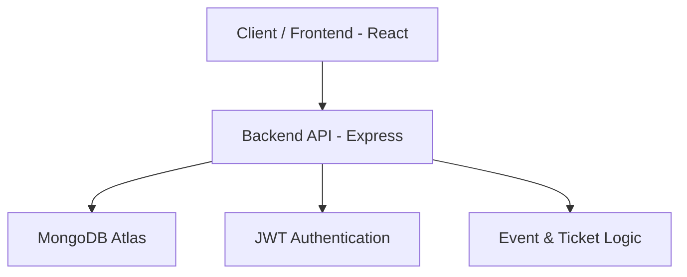

# Upcoming Organizer


## 1. Description

Upcoming Organizer is a full-stack event management application consisting of both backend and frontend services. It enables organizers to create and manage events, handle participant registrations, and issue tickets efficiently.

The **Backend** is built with **Node.js, Express, TypeScript, and MongoDB**, providing secure authentication, event scheduling, attendee management, and ticket validation APIs.

The **Frontend** is built with **React, TypeScript, and Parcel**, offering a user-friendly interface for managing events, attendees, and ticket bookings with a smooth and interactive experience.

## 2. Architecture



## 3. Tech Stack

### 3.1 Backend
- **Language & Runtime:** Node.js  
- **Framework:** Express  
- **Language:** TypeScript  
- **Database:** MongoDB (Atlas)

### 3.2 Frontend
- **Frontend Framework:** React  
- **Language:** TypeScript  
- **Bundler:** Parcel  
- **Styling / Libraries:** (Add if any, e.g., Tailwind CSS, React Router)

## 4. Features

### 4.1 Backend Features
- User authentication (JWT-based)  
- Event creation and management  
- Attendee management  
- Ticket booking and validation  
- Organizer module

### 4.2 Frontend Features
- Event listing  
- Ticket booking  
- Organizer dashboard  
- Attendee registration

## 5. Installation & Setup

### 5.1 Backend Setup

#### 5.1.1 Clone the repository:
```bash
git clone https://github.com/yourusername/upcoming-backend.git
```

#### 5.1.2 Navigate into the project directory:
```bash
cd upcoming-backend
```

#### 5.1.3 Install dependencies:
```bash
npm install
```

#### 5.1.4 Create a .env file in the root directory and add your environment variables (see section 6.1).

#### 5.1.5 Run the backend locally:
```bash
npm run dev
```

The server should now be running at http://localhost:10000 (or your configured port).

### 5.2 Frontend Setup

#### 5.2.1 Clone the repository:
```bash
git clone https://github.com/yourusername/upcoming-frontend.git
```

#### 5.2.2 Navigate into the project directory:
```bash
cd upcoming-frontend
```

#### 5.2.3 Install dependencies:
```bash
npm install
```

#### 5.2.4 Create a .env file in the root directory and add your environment variables (see section 6.2).

#### 5.2.5 Run the frontend locally:
```bash
npm run dev
```

Open http://localhost:1234 (or the port shown) in your browser to view the app.

## 6. Environment Variables

### 6.1 Backend Environment Variables

Create a `.env` file with the following variables (replace placeholders with your own values):

```env
MONGO_URI=<your_mongo_uri>

# JWT Keys
JWT_SECRET=<your_jwt_secret>
USER_ROLE=user
ORGANIZER_ROLE=organizer
ADMIN_ROLE=admin
ACCESS_TOKEN_EXPIRY_TIME=15m
REFRESH_TOKEN_EXPIRY_TIME=7d
```

### 6.2 Frontend Environment Variables

Create a `.env` file with the following variables:

```env
REACT_APP_ORGANIZER_API_BASE_URL=<your_backend_api_url>
```

## 7. Database

This backend uses MongoDB Atlas. Make sure your `MONGO_URI` in `.env` is correctly configured to connect to your Atlas cluster.

## 8. Deployment

### 8.1 Backend Deployment
The backend is deployed on Render:

https://upcoming-backend.onrender.com

You can access the APIs directly via this URL.

### 8.2 Frontend Deployment
The frontend is deployed on Vercel:

https://upcoming-frontend-rq1t.vercel.app